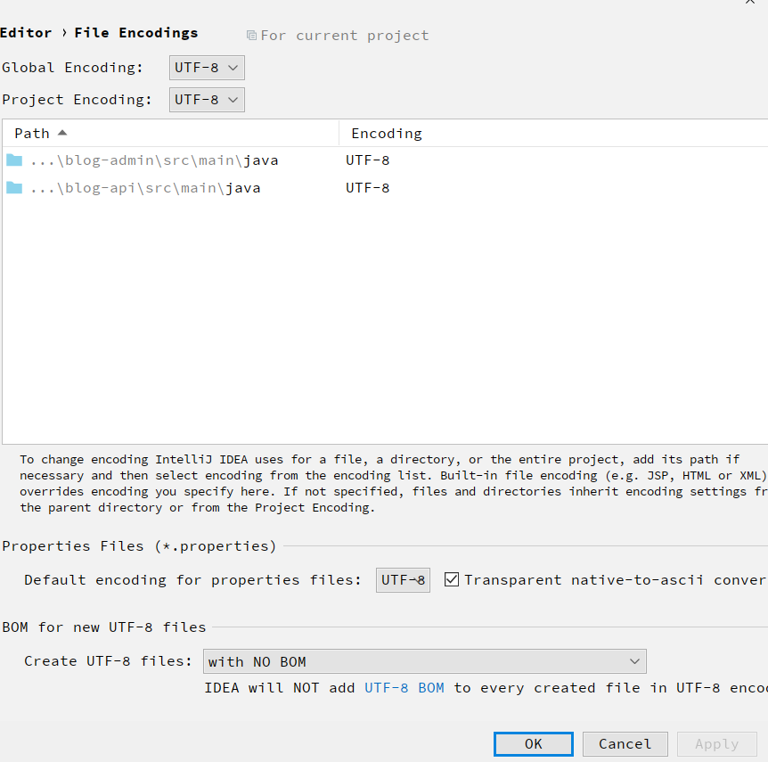

# 部署相关

# 1. 云服务器

购买阿里云服务器，如果是学生的话，很便宜

安装环境 ：yum 去安装

比如要安装java  ，百度搜 yum -y install java

比如要安装数据库，百度搜 yum如何安装mysql 5.7 

# 2. 域名备案

# 3. 部署

## 3.1 打包

可能遇到的问题，打包不成功, 但是代码可以正常运行

解决方案：

1. 文件编码不对，在setting -> File Encoding 中 改为UTF-8

   

2. 将原有的编译插件 更换为

   ~~~xml
    <plugins>
                   <plugin>
                       <groupId>org.apache.maven.plugins</groupId>
                       <artifactId>maven-resources-plugin</artifactId>
                       <version>2.7</version>
                       <dependencies>
                           <dependency>
                               <groupId>org.apache.maven.shared</groupId>
                               <artifactId>maven-filtering</artifactId>
                               <version>1.3</version>
                           </dependency>
                       </dependencies>
                   </plugin>
               </plugins>
   ~~~

   

# 4. 安装docker

~~~shell
# 1、yum 包更新到最新 
yum update
# 2、安装需要的软件包， yum-util 提供yum-config-manager功能，另外两个是devicemapper驱动依赖的 
yum install -y yum-utils device-mapper-persistent-data lvm2
# 3、 设置yum源
yum-config-manager --add-repo https://download.docker.com/linux/centos/docker-ce.repo
# 4、 安装docker，出现输入的界面都按 y 
yum install -y docker-ce
# 5、 查看docker版本，验证是否验证成功
docker -v
#启动docker
/bin/systemctl start docker.service
~~~

# 5. 拉取镜像

~~~shell

docker pull nginx
docker pull redis:5.0.3
docker pull java:8
docker pull mysql:5.7
~~~

## 5.1 mysql

创建容器，设置端口映射、目录映射

~~~shell
mkdir /mnt/docker/mysql
cd /mnt/docker/mysql
~~~

~~~shell
docker run -id \
-p 3307:3306 \
--name=c_mysql \
-v /mnt/docker/mysql/conf:/etc/mysql/conf.d \
-v /mnt/docker/mysql/logs:/logs \
-v /mnt/docker/mysql/data:/var/lib/mysql \
-e MYSQL_ROOT_PASSWORD=root \
mysql:5.7
~~~

在/mnt/docker/mysql/conf 创建my.cnf

~~~java

[mysqld]
#
# Remove leading # and set to the amount of RAM for the most important data
# cache in MySQL. Start at 70% of total RAM for dedicated server, else 10%.
# innodb_buffer_pool_size = 128M
#
# Remove leading # to turn on a very important data integrity option: logging
# changes to the binary log between backups.
# log_bin
#
# Remove leading # to set options mainly useful for reporting servers.
# The server defaults are faster for transactions and fast SELECTs.
# Adjust sizes as needed, experiment to find the optimal values.
# join_buffer_size = 128M
# sort_buffer_size = 2M
# read_rnd_buffer_size = 2M
datadir=/var/lib/mysql
socket=/var/lib/mysql/mysql.sock
character-set-server=utf8
# Disabling symbolic-links is recommended to prevent assorted security risks
symbolic-links=0
lower_case_table_names=1
pid-file=/var/run/mysqld/mysqld.pid
sql_mode=STRICT_TRANS_TABLES,NO_ZERO_IN_DATE,NO_ZERO_DATE,ERROR_FOR_DIVISION_BY_ZERO,NO_AUTO_CREATE_USER,NO_ENGINE_SUBSTITUTION
~~~

后续如果改mysql的配置文件 可以改这里

~~~shell
#去查看mysql对应的docker容器ip地址，配置到项目
docker inspect c_mysql
~~~

## 5.2 reids

~~~shell
docker run -id --name=redis -p 6379:6379 redis:5.0.3
~~~

#  6. Dockerfile

* Dockerfile 是一个文本文件
* 包含了一条条的指令
* 每一条指令构建一层，基于基础镜像，最终构建出一个新的镜像
* 对于开发人员：可以为开发团队提供一个完全一致的开发环境
* 对于测试人员：可以直接拿开发时所构建的镜像或者通过Dockerfile文件
  构建一个新的镜像开始工作了
* 对于运维人员：在部署时，可以实现应用的无缝移植

## 6.1 关键字

| 关键字      | 作用                     | 备注                                                         |
| ----------- | ------------------------ | ------------------------------------------------------------ |
| FROM        | 指定父镜像               | 指定dockerfile基于哪个image构建                              |
| MAINTAINER  | 作者信息                 | 用来标明这个dockerfile谁写的                                 |
| LABEL       | 标签                     | 用来标明dockerfile的标签 可以使用Label代替Maintainer 最终都是在docker image基本信息中可以查看 |
| RUN         | 执行命令                 | 执行一段命令 默认是/bin/sh 格式: RUN command 或者 RUN ["command" , "param1","param2"] |
| CMD         | 容器启动命令             | 提供启动容器时候的默认命令 和ENTRYPOINT配合使用.格式 CMD command param1 param2 或者 CMD ["command" , "param1","param2"] |
| ENTRYPOINT  | 入口                     | 一般在制作一些执行就关闭的容器中会使用                       |
| COPY        | 复制文件                 | build的时候复制文件到image中                                 |
| ADD         | 添加文件                 | build的时候添加文件到image中 不仅仅局限于当前build上下文 可以来源于远程服务 |
| ENV         | 环境变量                 | 指定build时候的环境变量 可以在启动的容器的时候 通过-e覆盖 格式ENV name=value |
| ARG         | 构建参数                 | 构建参数 只在构建的时候使用的参数 如果有ENV 那么ENV的相同名字的值始终覆盖arg的参数 |
| VOLUME      | 定义外部可以挂载的数据卷 | 指定build的image那些目录可以启动的时候挂载到文件系统中 启动容器的时候使用 -v 绑定 格式 VOLUME ["目录"] |
| EXPOSE      | 暴露端口                 | 定义容器运行的时候监听的端口 启动容器的使用-p来绑定暴露端口 格式: EXPOSE 8080 或者 EXPOSE 8080/udp |
| WORKDIR     | 工作目录                 | 指定容器内部的工作目录 如果没有创建则自动创建 如果指定/ 使用的是绝对地址 如果不是/开头那么是在上一条workdir的路径的相对路径 |
| USER        | 指定执行用户             | 指定build或者启动的时候 用户 在RUN CMD ENTRYPONT执行的时候的用户 |
| HEALTHCHECK | 健康检查                 | 指定监测当前容器的健康监测的命令 基本上没用 因为很多时候 应用本身有健康监测机制 |
| ONBUILD     | 触发器                   | 当存在ONBUILD关键字的镜像作为基础镜像的时候 当执行FROM完成之后 会执行 ONBUILD的命令 但是不影响当前镜像 用处也不怎么大 |
| STOPSIGNAL  | 发送信号量到宿主机       | 该STOPSIGNAL指令设置将发送到容器的系统调用信号以退出。       |
| SHELL       | 指定执行脚本的shell      | 指定RUN CMD ENTRYPOINT 执行命令的时候 使用的shell            |

## 6.2 发布springboot项目

定义dockerfile，发布springboot项目

**实现步骤** 

​     ① 定义父镜像：FROM java:8 

​     ② 定义作者信息：MAINTAINER mszlu <test@mszlu.com> 

​     ③ 将jar包添加到容器： ADD springboot.jar app.jar 

​     ④ 定义容器启动执行的命令：CMD java –jar app.jar 

​     ⑤ 通过dockerfile构建镜像：docker bulid –f dockerfile文件路径 –t 镜像名称:版本

~~~shell
FROM java:8
MAINTAINER mszlu <xuge@mszlu.com>
ADD ./blog_api.jar /app.jar
CMD java -jar /app.jar --spring.profiles.active=dev
~~~

执行构建命令：

~~~shell
docker build -f ./springboot_dockerfile -t app .
~~~

# 7. 服务编排

## 7.1 安装Docker Compose

~~~shell
# Compose目前已经完全支持Linux、Mac OS和Windows，在我们安装Compose之前，需要先安装Docker。下面我 们以编译好的二进制包方式安装在Linux系统中。 
curl -L https://github.com/docker/compose/releases/download/1.22.0/docker-compose-`uname -s`-`uname -m` -o /usr/local/bin/docker-compose
# 设置文件可执行权限 
chmod +x /usr/local/bin/docker-compose
# 查看版本信息 
docker-compose -version
~~~

## 7.2 使用docker compose编排nginx+springboot项目

1. 创建docker-compose目录

   ~~~shell
   mkdir /mnt/docker/docker-compose
   cd /mnt/docker/docker-compose
   ~~~

   

2. 编写 docker-compose.yml 文件

   ~~~shell
   version: '3'
   services:
     nginx:
      image: nginx
      container_name: nginx
      ports:
       - 80:80
       - 443:443
      links:
      	- app
      depends_on:
       - app
      volumes:
       - /mnt/docker/docker-compose/nginx/:/etc/nginx/
       - /mnt/mszlu/web:/mszlu/web
       - /mnt/mszlu/blog:/mszlu/blog
      network_mode: "bridge"
     app:
       image: app
       container_name: app
       expose:
         - "8888"
       network_mode: "bridge"
   ~~~

3. 创建./nginx目录

   ~~~shell
   mkdir -p ./nginx
   ~~~

   

4. 在./nginx目录下 编写nginx.conf文件

   ~~~java
   
   user  nginx;
   worker_processes  1;
   
   error_log  /var/log/nginx/error.log warn;
   pid        /var/run/nginx.pid;
   
   
   events {
       worker_connections  1024;
   }
   
   
   http {
       include       /etc/nginx/mime.types;
       default_type  application/octet-stream;
   
       log_format  main  '$remote_addr - $remote_user [$time_local] "$request" '
                         '$status $body_bytes_sent "$http_referer" '
                         '"$http_user_agent" "$http_x_forwarded_for"';
   
       access_log  /var/log/nginx/access.log  main;
   
       sendfile        on;
       #tcp_nopush     on;
   
       keepalive_timeout  65;
   
       #gzip  on;
   
       include /etc/nginx/conf.d/*.conf;
   }
   
   
   ~~~

   

5. 在nginx下创建conf.d目录，conf.d下创建blog.conf

   ~~~shell
   gzip_min_length 1k;
   gzip_buffers 4 16k;
   gzip_comp_level 2;
   gzip_vary off;
   upstream appstream{
        
           server app:8888;
   }
   
   server{
   
       listen  80;
       server_name mszlu.com www.mszlu.com;
       rewrite ^(.*) https://www.mszlu.com/$1 permanent;
   }
   
   server{
           listen 80;
           server_name blog.mszlu.com;
           rewrite ^(.*) https://blog.mszlu.com/$1 permanent;
   }
   
    server {
   
        listen       443 ssl;
   
        server_name  mszlu.com www.mszlu.com;
   
        index   index.html;
   
        ssl_certificate      /etc/nginx/ssl/mszlu.com.crt;
   
        ssl_certificate_key  /etc/nginx/ssl/mszlu.com.key;
   
        ssl_session_timeout  5m;
   
        location / {
   
              root   /mszlu/web;
   
              index index.html;
   
         }
   
    }
   
    server {
   
                  listen       443 ssl;
   
                  server_name  blog.mszlu.com;
   
                  index   index.html;
   
                  ssl_certificate      /etc/nginx/ssl/blog.mszlu.com.crt;
   
                  ssl_certificate_key  /etc/nginx/ssl/blog.mszlu.com.key;
   
                  ssl_session_timeout  5m;
   
                  location /api {
   					proxy_pass http://appstream;
                  }
   
                  location / {
                           root /mszlu/blog/;
                          index index.html;
                  }
                 location ~* \.(jpg|jpeg|gif|png|swf|rar|zip|css|js|map|svg|woff|ttf|txt)$ {
                             root /mszlu/blog/;
                             index index.html;
                             add_header Access-Control-Allow-Origin *;
                     }
   
      }
   ~~~

   

6. 在/mnt/docker/docker-compose 目录下 使用docker-compose 启动容器

   ~~~shell
   docker-compose up
   
   docker-compose up -d #代表后台启动
   ~~~

7. 测试访问